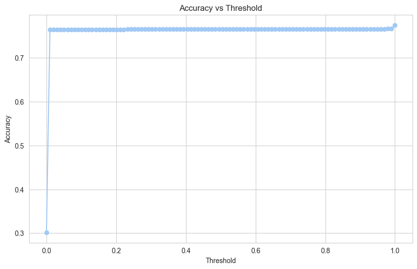
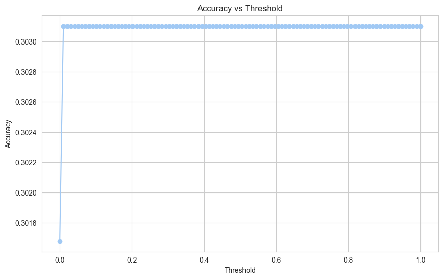

# Example-Dependent Cost-Sensitive Logistic Regression

This project, a component of the CS6890 Fraud Analytics course, explores example-dependent cost-sensitive classification, a scenario where misclassification costs differ for each instance.  The primary application focus of this study is credit scoring, where financial implications of misclassification are not uniform. 

We introduce and evaluate a novel classification method based on an example-dependent cost matrix tailored for credit scoring.  Our findings demonstrate that integrating real financial costs into the models leads to significant improvements, particularly in terms of financial savings.  This project implements and compares two distinct approaches on a given dataset: the Bahnsen approach and the Nikou-Gunnemann approach. 

## 📝 Problem Statement

In many real-world machine learning applications like medical diagnosis, fraud detection, and credit scoring, the cost of a false positive is not the same as the cost of a false negative.  Standard logistic regression models often assign equal weight to these errors, which is not ideal for cost-sensitive scenarios.  For example, in medical diagnostics, failing to detect a disease (a false negative) can have much more severe consequences than a false positive.  This project addresses this challenge by incorporating varying costs into the model to enhance its performance in real-world applications. 

## 💾 Dataset

The dataset used for this project is `costsensitiveregression.csv` (in the repository, it is named `data.csv`). It contains 147,636 entries and 13 columns. 

**Features:**
* **Independent Variables**: `NotCount`, `YesCount`, `ATPM`, `PFD`, `PFG`, `SFD`, `SFG`, `WP`, `WS`, `AH`, `AN` 
* **Dependent Variable**: `Status` (1 for fraud, 0 for not fraud) 
* **Costs**:
    * `FNC`: A variable cost for false negatives, indicating the penalty for predicting "Not fraud" when it is actually "fraud". 
    * The costs for True Positive and False Positive are constant at 6 for all instances.
    * The cost for a True Negative is constant at 0 for all instances.

The dataset is imbalanced, with non-fraud cases being more than double the fraud cases. 

## 🤖 Algorithms Implemented

To handle the class imbalance and cost-sensitivity, this project implements two specific methods for modeling the cost function. 

### 1. Bahnsen's Approach

This approach modifies the learning process to directly incorporate the cost of misclassification.  The risk for predicting an example as negative or positive is calculated, and the model parameters are optimized to minimize a new cost function, $J_{c}(\theta)$. 

Since this cost function is non-differentiable and non-convex, traditional optimization methods are not suitable.  Therefore, a Genetic Algorithm, specifically Differential Evolution (DE), is employed to find the global minimum. 

### 2. Nikou-Günnemann's Approach

This method also addresses binary classification with example-dependent costs by modifying the logistic loss function.  The loss function is weighted based on the cost associated with each instance. 

Similar to Bahnsen's approach, the resulting cost function is non-differentiable and non-convex.  Consequently, the Differential Evolution (DE) algorithm is also used for optimization. 

## 📊 Results

The models were evaluated based on both accuracy and a total cost function that accounts for the financial implications of predictions. 

| Model | Accuracy | Total Cost |
| :--- | :--- | :--- |
| Logistic Regression | 86.27% | 337088.46 |
| **Bahnsen's Method** | **76.56%** | **50508.05** |
| Nikou Günnemann's Method | 30.31% | 88458.00 |

*Tables are based on the results presented in the project report.* 

### Threshold vs. Accuracy

*Accuracy plot for the Bahnsen Method*


*Accuracy plot for the Nikou-Gunnemann Method*



## ✅ Conclusion

The results indicate that while a standard Logistic Regression model can achieve high accuracy, it performs poorly in terms of total financial cost.  Bahnsen's method, despite having lower accuracy, yielded a significantly lower total cost, making it the most effective model for this specific dataset and problem.  This highlights the critical importance of incorporating problem-specific cost metrics into the model evaluation process. 

## 🚀 How to Run

1.  Clone the repository:
    ```bash
    git clone [<repository-url>](https://github.com/koushikmaji31/cost_sensetive_regression.git)
    ```
2.  Navigate to the project directory:
    ```bash
    cd [<repository-name>](https://github.com/koushikmaji31/cost_sensetive_regression.git)
    ```
3.  The main implementation can be found in `ans.ipynb`. You can open and run this Jupyter Notebook to see the code and reproduce the results.

## 🤝 Contributors

* Anirudh Joshi (CS23MTECH11002)
* Malsawmsanga Sailo (CS23MTECH11010)
* Koushik Maji (AI23MTECH11004)
